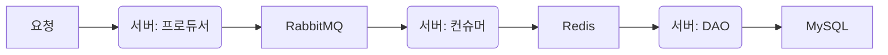
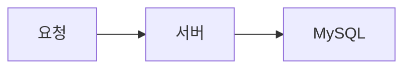

# 목적

대용량 트래픽 관련 대응법을 다시 한 번 시도해보며 어떠한 차이가 있는지 확인을 위함.

# 실행 방법

## IDE 등을 통해 스프링부트 자체를 실행할 경우

실행 시 도커 컴포즈에 적힌 컨테이너들과 애플리케이션을 자동으로 연결

## 도커 컴포즈를 사용하여 도커 환경에서 실행하는 경우

`docker compose --profile docker up --build`

### 설명

- 도커 컴포즈 'docker'라는 프로필로 실행
- 도커 컴포즈 내 app이 활성화
- 해당 app은 스프링부트 docker 프로필을 활성화
- 다른 도커 컨테이너와 연결을 수행

## 주의

- DLX, DLQ 처리를 하지 않음
- Redis 초기화 처리를 하지 않음

# 처리 방법

## RabbitMQ + Redis

스레드 풀 크기(기본 200개)가 정해진 Spring의 단점을 해소하기 위해 & 서버 인스턴스가 늘어나더라도 문제가 없도록 구성하기 위해 요청들을 RabbitMQ에 쌓도록 함.

RabbitMQ 대기열을 통해, 대량의 요청이 들어오더라도 차례차례 해소할 수 있도록 함.

대기열에서 가져온 요청은 Redis List에 저장되어 있는 특정 id들을 가져옴.

만약 Redis에 아무 값도 없는 경우(서버가 강제로 내려가 데이터가 보존되지 않은 경우 or 해당 아이템에 대한 첫 요청인 경우) DB에 존재하는 유효한 데이터들을 획득하여 쌓도록 함.

위 과정에서 Redis와 DB의 정합성을 맞추기 위해 분산락을 사용하여 요청들을 대기시키도록 함.

## Query(SKIP LOCKED)

`SKIP LOCKED` 쿼리를 사용하면 락이 걸린 튜플을 건너뛸 수 있음.

이를 통해 현재 처리중인 요청이 아닌 튜플 하나만 업데이트하는 방식을 구성할 수 있지 않을까 함.

해당 방식은 RabbitMQ, Redis 등의 자원을 쓰지 않고도 동시성 문제를 해소할 수 있을 것이라 예상.

# Flow

> 코드의 단순화를 위해 Coupon은 id(UUID)와 업데이트될 필드(account_id)만 지닌다.

## RabbitMQ + Redis

1. 사용자의 요청들을 RabbitMQ에 적재
    1. 서버는 요청을 받은 후, Validate 과정만 거침
    2. 직후 RabbitMQ에 해당 요청을 담도록 함
2. 서버에서 큐의 요청들을 가져옴
3. 요청에 속하는 임의의 쿠폰 코드를 Redis에서 가져옴
    1. Redis에 해당 값이 없다면, MySQL에서 조회 후 Redis에 캐싱
    2. 해당 과정은 정합성을 위해 분산락이 동반되어야 함
4. 해당 쿠폰코드를 통해 업데이트 쿼리를 수행

## SKIP LOCKED

1. 사용자의 요청에 대해 바로 처리
2. MySQL 튜플에 배타락 + SKIP LOCKED를 통해 `이미 락이 걸린 튜플`을 건너뛴다.
3. 해당 튜플에 대해 업데이트
    1. 바로 업데이트 쿼리를 수행시키는 방법
        1. 업데이트 쿼리와 동시에 배타락을 걸 수 있는가? -> MySQL에서는 불가
    2. FOR UPDATE로 객체를 가져오고, EntityManager를 통해 업데이트하는 방법
4. 동시성 문제가 발생하지 않는지 확인
5. 만약 발생하지 않는다면, MySQL의 어느 곳에서 이를 처리해주기 때문인지 학습

# 1차 결과

> RabbitMQ를 거치지 않고 Redis와 Redisson만 거친 중간 단계도 추가\
> 소수점 두번째 자리에서 반올림

|    구분    | RabbitMQ + Redis + Redisson | Redis + Redisson | SKIP LOCKED |
|:--------:|:---------------------------:|:----------------:|:-----------:|
|  1,000건  |          1,933.5ms          |    1,130.8ms     |  1,117.5ms  |
| 10,000건  |         13,288.5ms          |    10,385.3ms    |  9,647.3ms  |
| 100,000건 |         86,797.8ms          |    71,572.3ms    | 70,808.5ms  |

## RabbitMQ보다 SKIP LOCKED가 더 빠른 이유?

### Spring 내부 테스트를 통해서만 시간을 계산했기 때문?

- Spring의 test에서는 비동기적으로 각 컨트롤러 메서드를 실행시키고 있는데, 해당 과정에서 머신의 능력에 따라 한계점이 있을 것이라고 생각.
    - 즉 많은 요청이 한번에 들어오는 상황보다는, 머신 기기의 일정 한계치까지 메서드를 실행시키기 때문에 기존 Tomcat 스레드 제한을 해결하기 위해 사용했던 RabbitMQ가 더 느린 성능을 보인 것으로
      예상.
- 여러 WAS가 아닌 한 대의 WAS 환경에서는 오히려 enque, deque 과정에서 오버헤드가 있었을 것

## Redis로 캐싱하는 과정이 SKIP LOCKED보다 빨라야 하는 것 아닌가?

- Redis를 사용하는 과정은 올바른 쿠폰코드와 유저id가 있기 때문에, 한 번의 UPDATE 쿼리로 동작할 수 있음. 그러나 현재 더티 체킹을 통해 2번 동작 중.
    - 즉, 쿼리 송수신 과정 최적화 후 한번 더 테스팅해야 함.
- 반면 SKIP LOCKED는 어떤 Coupon Entity를 획득할 지 모르기 때문에 SELECT 쿼리 + 더티 체킹을 통한 UPDATE로 동작
- 속도를 추정하자면 Redis가 더 빨라야 함
    - Redis는 한 번의 쿼리 발생, SKIP LOCKED는 두 번의 쿼리 발생
    - 메모리에 쿠폰코드를 올려두고 이를 가져오는 속도가 MySQL 네트워킹, I/O보다는 빠를 것

# 쿼리 송수신 최적화 후 2차 결과

|    구분    | RabbitMQ + Redis + Redisson | Redis + Redisson | SKIP LOCKED |
|:--------:|:---------------------------:|:----------------:|:-----------:|
|  1,000건  |          1,650.3ms          |      1322ms      |  1313.5ms   |
| 10,000건  |         12,181.5ms          |      9100ms      |  9508.3ms   |
| 100,000건 |          75742.7ms          |    61247.3ms     |   70591ms   |

건수가 많아질수록 예상 결과와 일치하는 것 확인.

# 배운 것

- 이전 프로젝트에서 RabbitMQ와 Redis 도입이 오버엔지니어링이었다는 것을 확신함.
- Redis를 도입해보는 것도 좋지만, 쿼리 발생 횟수 등의 요인도 무시할 수 없음.
- 극적인 성능 개선이 필요할 때 캐싱 도입 등을 알아볼 것.
- 해당 테스트는 어디까지나 하나의 머신에서 이루어진 것임을 잊지 말 것.

# TODO

- [x] MySQL 연결
- [x] Redis 연결
- [x] RabbitMQ 연결
- [x] 1,000개의 쿠폰 데이터 삽입하기
- [x] RabbitMQ + Redis로 여러 사용자의 요청 처리
    - [x] 사용자 요청을 RabbitMQ로 전달
    - [x] RabbitMQ에서 요청을 가져옴
        - [x] 어떻게 해야 효과적으로 RabbitMQ들의 요청들을 처리할 수 있는가? 에 대한 학습
            - concurrency
            - prefetch
    - [x] Redis의 쿠폰 코드를 하나씩 가져와 요청 처리
        - [x] Redis에 쿠폰 코드 캐싱을 위해 분산락 사용
- [x] SKIP LOCKED 쿼리 실행
    - [x] JPQL로 처리 가능한가? QueryDSL 통해 처리 가능한가? 어노테이션을 사용할 수 있는가? 등 확인하기
    - [x] 쿼리 플랜 결과 분석
- [x] 서비스 분리해서 테스트 돌려보기
    - [x] 시간 차이는 얼마나 나는가?
    - [x] 두 방법의 장점과 단점은 무엇인가?
